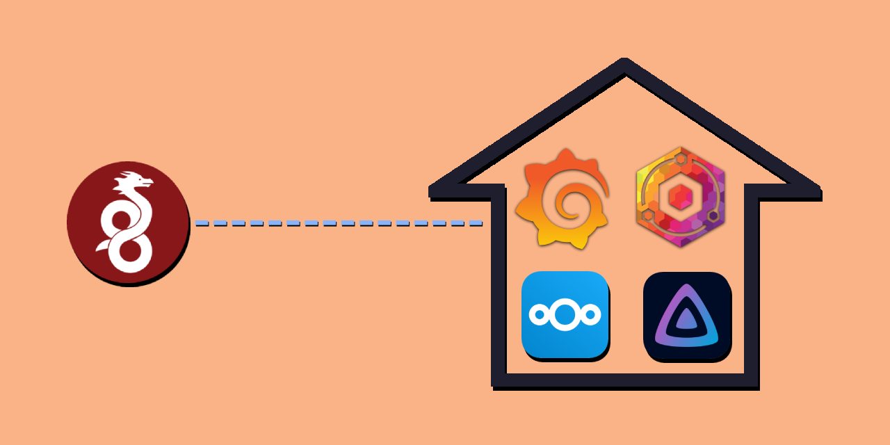

# ❖ Introduction

Tilde aims to be a starting point for anyone getting started in their self-hosting journey.
It uses [Pyinfra](https://pyinfra.com/) to configure a new server and deploy commonly used applications
using [Docker](https://www.docker.com/). Please note that Tilde only targets and supports
[Debian](https://www.debian.org/).

## ❖ Features

Tilde configures the following things for you:

  - A [Docker](https://www.docker.com/) install to easily spin up other services
  - A [Wireguard](https://www.wireguard.com/) tunnel with a user-friendly interface so you can access your services
  when you're not home.
  - Dynamic DNS using [DuckDNS](https://www.duckdns.org/) so that Wireguard can always connect to your server
  - A [Nextcloud](https://nextcloud.com/) instance for cloud storage
  - A [Jellyfin](https://jellyfin.org/) instance for media consumption
  - [Grafana](https://grafana.com/) with [Prometheus](https://prometheus.io/) for server monitoring
    - Comes with [Node Exporter](https://github.com/prometheus/node_exporter) (System Stats) and [cadvisor](https://github.com/google/cadvisor) (Container Stats) pre-configured. Add any dashboard compatible with them.
  - A [Nginx Proxy Manager](https://nginxproxymanager.com/) Instance for reverse proxy and TLS (Configured by the user)
